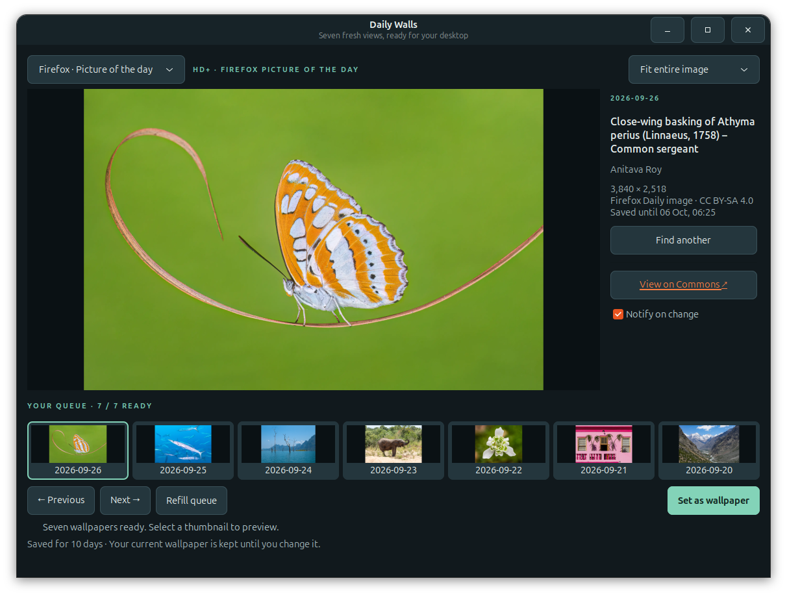

# Daily Walls

Browse landscape wallpapers, compare alternatives before choosing, and keep a
local collection with automatic ten-day retention. Sources include Wikimedia
Commons, Bing, Firefox Picture of the Day, and images imported from your computer.



[Photograph credits](assets/screenshots/CREDITS.md) · [Linux guide](docs/linux.md) ·
[Windows guide](windows/README.md) · [Release history](CHANGELOG.md)

## Downloads

| Platform | Status | Package / instructions |
| --- | --- | --- |
| Debian / Ubuntu | Stable Linux 1.1.3 | [Download DEB](https://github.com/KhuramMurad/daily-walls/releases/download/v1.1.3/daily-walls_1.1.3_all.deb) |
| Fedora | Stable Linux 1.1.3 | [Download RPM](https://github.com/KhuramMurad/daily-walls/releases/download/v1.1.3/daily-walls-1.1.3-1.noarch.rpm) |
| Windows 11 x64 | Preview 1.2.0-alpha.2 | [Download portable ZIP](https://github.com/KhuramMurad/daily-walls/releases/download/v1.2.0-alpha.2/daily-walls-1.2.0-alpha.2-windows-x64.zip) |

Linux downloads: [release notes and all assets](https://github.com/KhuramMurad/daily-walls/releases/tag/v1.1.3)
and [SHA-256 checksums](https://github.com/KhuramMurad/daily-walls/releases/download/v1.1.3/SHA256SUMS).
Older packages remain on the [Releases page](https://github.com/KhuramMurad/daily-walls/releases).

Installers are published as **GitHub Release assets**, not committed binaries.
GitHub's automatically generated source ZIP/TAR archives are source code, not installers.
Windows has a [separate preview release](https://github.com/KhuramMurad/daily-walls/releases/tag/v1.2.0-alpha.2)
with its own checksum. Extract the entire ZIP and open `DailyWalls.exe`; keep
`_internal` beside it. Python and MSYS2 are not required. See the
[Windows guide](windows/README.md) for maintenance and known limitations.

## Install or upgrade on Linux

Download the package for your distribution, then run:

```sh
# Debian / Ubuntu
sudo apt install ./daily-walls_1.1.3_all.deb

# Fedora
sudo dnf install ./daily-walls-1.1.3-1.noarch.rpm
```

Open **Daily Walls** from your application menu, or run `daily-walls --gui`.
After upgrading, close and reopen an already-running app. Your saved wallpapers
and settings are preserved. Packages require Python 3.10 or newer and install
the declared GTK, Pillow, and WebP runtime dependencies.

GNOME, Cinnamon, KDE, XFCE, Sway, Hyprland, and generic X11 have wallpaper backends.
Desktop-specific utilities such as `swaybg`, `hyprpaper`, or `feh` must be installed
for the corresponding desktop. Installation does not change your wallpaper or
enable background jobs.

With `SHA256SUMS` and both installers in the same download directory:

```sh
sha256sum --check SHA256SUMS
```

Packages are unsigned. No open-source license has been declared for this project.

## Features

- Separate queues of up to seven images for each source, with persistent duplicate detection.
- **Find another** shows the selected and new image side by side before changing the queue.
- **Saved wallpapers** displays retained images, including replaced and previously used files.
- **Locally saved wallpapers** imports landscape JPEG, PNG, and WebP images from any source.
- Fit/fill previews preserve proportions without modifying originals.
- Managed files expire ten days after download/import; the current wallpaper stays protected.
- Original files selected for local import are never deleted or modified.

Commons selects assessed 4K wallpapers across seven scenery subjects. Bing uses
its recent 4K archive; Firefox and local imports accept landscape images of at
least 1920 × 1080. Local imports are filled manually. See the
[Linux guide](docs/linux.md) for source details, storage, retention, and commands.

## Optional Linux background maintenance

The app maintains its library while open. To also run hourly maintenance while closed:

```sh
systemctl --user daemon-reload
systemctl --user enable --now wiki-wallpaper-maintenance.timer
```

To disable it:

```sh
systemctl --user disable --now wiki-wallpaper-maintenance.timer
```

Older source-checkout service overrides in `~/.config/systemd/user/` must use
`ExecStart=/usr/bin/daily-walls --maintain` and remove checkout-specific
`WorkingDirectory` settings. These overrides take precedence over packaged units.

## Build from source

Both platforms share the **main** branch and application logic. Platform-specific
packaging, configuration, build folders, and outputs are separate.

| Platform | Build command | Outputs |
| --- | --- | --- |
| Linux | `python3 packaging/build.py` | `dist/linux/`: DEB, RPM, `SHA256SUMS` |
| Windows | `python windows/build.py` (on Windows) | `dist/windows/`: portable ZIP, `SHA256SUMS`, unpacked application |

The Linux builder requires `dpkg-deb` and `rpmbuild`. The Windows builder requires
MSYS2 UCRT64 and the dependencies listed in [windows/README.md](windows/README.md).
A Windows executable cannot be built by running the Windows builder on Fedora.

```text
app.py, library.py, fetcher.py, ...  Shared application and Linux integration
platform_support.py                Platform paths and file-lock adapters
packaging/                         Linux DEB/RPM builder
systemd/                           Linux maintenance units
windows/                           Windows runtime, scripts, icon, build spec, and tests
docs/linux.md                      Detailed Linux usage guide
build/linux/                       Temporary Linux build files (ignored)
build/windows/                     Temporary Windows build files (ignored)
dist/linux/                        Linux release artifacts (ignored)
dist/windows/                      Windows build artifacts (ignored)
```

The active Windows build workflow is `.github/workflows/windows.yml`, mirrored
in `windows/github-actions.yml`. Pushes to `main` build and validate the Windows
package and upload Actions artifacts. Public releases are published separately.

## Development checks

From the repository root, with Python, PyGObject, GTK 3, and Pillow installed:

```sh
python3 -m unittest discover -s tests -v
python3 -m unittest discover -s windows/tests -v
```

Tests use temporary libraries and mock desktop changes. Both Windows executables
pass packaged GUI/runtime checks on a Windows Server 2022 runner. Interactive
wallpaper changes, notifications, and scheduling still need Windows 11 desktop validation.
